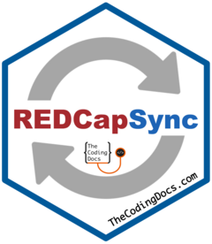
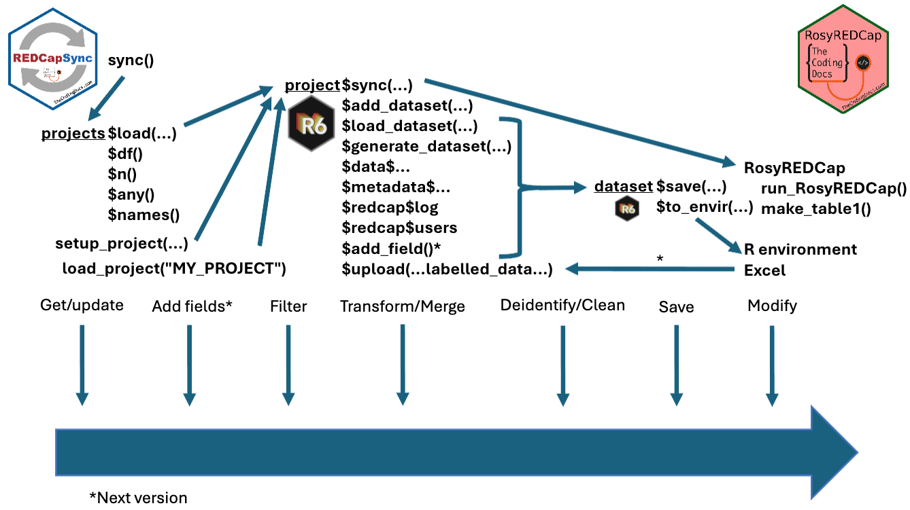
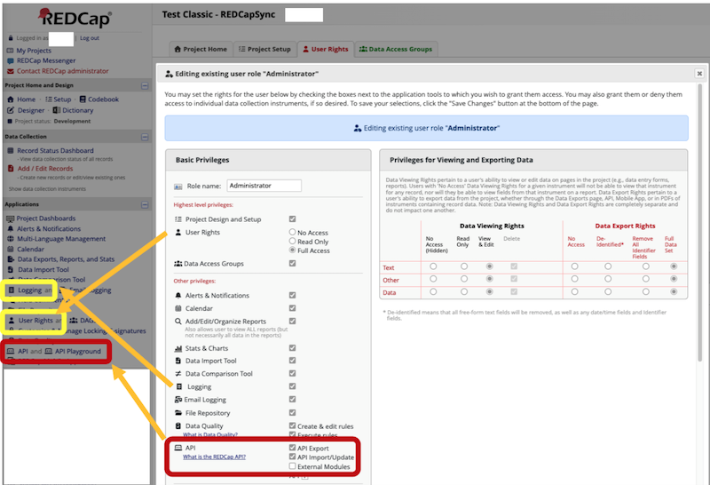
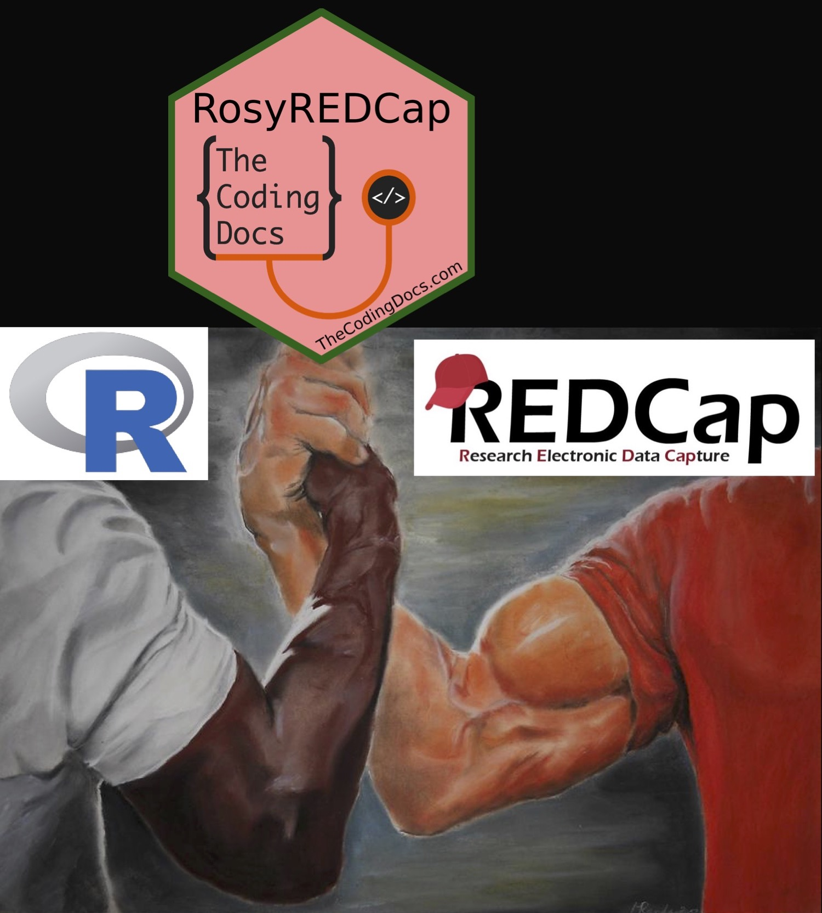

# REDCapSync <a href="https://thecodingdocs.github.io/REDCapSync/"></a>

<!-- badges: start -->

[](https://lifecycle.r-lib.org/articles/stages.html#experimental)
[](https://github.com/thecodingdocs/REDCapSync/actions/workflows/R-CMD-check.yaml)
[](https://app.codecov.io/gh/thecodingdocs/REDCapSync)
[](https://www.gnu.org/licenses/gpl-3.0)
[](https://CRAN.R-project.org/package=REDCapSync)
<!-- badges: end -->

Several R packages exist for using the
[REDCap](https://projectredcap.org/) Application Program Interface (API)
such as, [`redcapAPI`](https://github.com/vubiostat/redcapAPI),
[`REDCapR`](https://ouhscbbmc.github.io/REDCapR/), and
[`tidyREDCap`](https://raymondbalise.github.io/tidyREDCap/). However,
[`REDCapSync`](https://thecodingdocs.github.io/REDCapSync/) is the first
“get-everything” REDCap R package that converts REDCap projects into a
standardized, API-efficient, and project-agnostic
[R6](https://r6.r-lib.org/) object.

## What is REDCapSync?

[`REDCapSync`](https://thecodingdocs.github.io/REDCapSync/) unleashes
the full power of the REDCap API even for the basic R user. When a sync
is performed,
[`REDCapSync`](https://thecodingdocs.github.io/REDCapSync/) uses a cache
of previous saves, a user-defined directory, and the REDCap log to only
update data that changed since the last API call. Project objects can be
used for the best that R has to offer via statistics, visualization,
functions, shiny apps, and more!

The aims of [`REDCapSync`](https://thecodingdocs.github.io/REDCapSync/)
are to…

1.  Encapsulate the REDCap API into one standardized object to
    streamline use.
2.  Automate common tasks such as cleaning, deidentification and merges.
3.  Automate distribution of user-defined Excel datasets to local/cloud
    storage for one or many REDCap projects.
4.  Convert ***labelled*** REDCap data from R or Excel for upload using
    REDCap API.
5.  Power the companion shiny app
    [`RosyREDCap`](https://thecodingdocs.github.io/RosyREDCap/ "RosyREDCap R package")

By leveraging the combined strengths of R and REDCap, users can maintain
strong data pipelines that include statistics, visuals, and even shiny
applications!

## Installation

The stable *release* version can be installed from
[CRAN](https://cran.r-project.org/package=REDCapSync).

``` r
install.packages("REDCapSync")
```

### Development Version

You can install the development version from GitHub with the
[`pak`](https://pak.r-lib.org). Windows users may need to install
[RTools version
4.5](https://cran.r-project.org/bin/windows/Rtools/rtools45/rtools.html "R Getting Started")
to use pak.

``` r
# install.packages("pak")
pak::pak("thecodingdocs/REDCapSync")
```

Alternatively, you can install the development version from GitHub with
the [`remotes`](https://remotes.r-lib.org) package.

``` r
# install.packages("remotes")
remotes::install_github("thecodingdocs/REDCapSync")
```

If you have any issues, try downloading the most recent version of R at
RStudio and update all packages in RStudio. See
[thecodingdocs.com/r/getting-started](https://www.thecodingdocs.com/r/getting-started "R Getting Started").

## Getting Started!

Getting started is as simple as 1.) setting your token, 2.) setting up a
project, and 3.) running project\$sync(). See [Getting
Started](REDCapSync.html "Getting Started") page for the basics! If you
need more help setting your tokens, see the
[Tokens](Tokens.html "Tokens vignette.") vignette.

``` r
# 1.) setting your token -------------------------------------------------------
Sys.setenv(REDCAPSYNC_FIRST_PROJECT = "YoUrNevErShaReToken")    # in console
# or WAY BETTER put this in your .Renviron file...
# REDCAPSYNC_FIRST_PROJECT = 'YoUrNevErShaReToken
# Then save file, restart R session (`.rs.restartR()`) and library(REDCapSync)

# 2.) setting up a project -----------------------------------------------------
project <- setup_project(
  project_name = "FIRST_PROJECT",                       
  redcap_uri = "https://redcap.fake.edu/api/",             # same as REDCapR
  dir_path = getwd(),                            # choose appropriate folder
  sync_frequency = "daily",                          # only checks max daily 
  get_entire_log = TRUE                       # for small or medium projects
)

# install.packages("keyring") 
project$test_token()                    # will launch keyring if token fails

# 3.) running project$sync() ---------------------------------------------------
project$sync() 

project$generate_dataset("custom", envir = globalenv())        
```

For an in-depth demonstration of both REDCapSync and RosyREDCap, see
[RMed26-Demo](https://thecodingdocs.github.io/RMed26-Demo/ "RMed26-Demo").

## Framework

<figure>

<figcaption aria-hidden="true">A diagram of REDCapSync framework showing
projects to project to dataset.</figcaption>
</figure>

## Minimum Requirements

- R (and RStudio) installed on your computer or server.
- Access to at least one REDCap project (real or test) with API Token
  privileges according to user rights.
- Ideally, you should have User Permissions to logging in order to use
  the package efficiently
- Appropriate permission to export and analyze data for projects for
  which you have a token.
- Basic R knowledge such as installing a package and running code.
- Thoughtful attention to how and where data you create is used and
  stored.

<figure>

<figcaption aria-hidden="true">Shows on REDCap website user rights page
the user with the token needs API token export privileges and ideally
logging privileges</figcaption>
</figure>

## Contributing

If you wish to contribute to this software, use github issues and pull
requests.

### Style Guidelines

#### Functions

- Exported function names: **snake_case**
  - Examples: setup_project, load_project, sync
- Internal function names: **snake_case**
  - Examples: get_project_token, get_redcap_data
  - Exceptions: .onLoad (R standard)
    - redcapAPI functions (**dromedaryCase**)
    - utils functions: write.csv, object.size, browseURL
- Function parameters: **snake_case**
  - examples: project_name, dir_path, redcap_uri, sync_frequency
- Function variables: **snake_case**

#### Constants/Data

- Internal constants: **SCREAMING_SNAKE_CASE**
  - Examples: FAKE_TOKEN, BLANK_PROJECT_COLS, SYNC_FREQUENCY
- Internal datasets: **SCREAMING_SNAKE_CASE**
  - Examples: TEST_CLASSIC, TEST_REPEATING, TEST_CANCER
- Environment variable names: **SCREAMING_SNAKE_CASE**
  - Examples: REDCAPSYNC_TEST_CLASSIC

#### R6 Class

- R6ClassGenerator and R6 Classes: **PascalCase** with capitalized
  “REDCap” acronym
  - Example: REDCapSyncProject
- R6 public_methods: snake_case
- R6 active_bindings: snake_case
  - Exception: .internal for custom functions

#### Package Use

- project_name: SCREAMING_SNAKE_CASE (numbers allowed if not first)
- REDCapSyncProject object environment name can be “project” or
  user-defined
- Package options: **snake.case**
  - Examples: redcapsync.config.show.api.messages

## Disclaimers

- With great power comes great responsibility! The REDCap API has the
  with ability to read and write sensitive data. The API token holder is
  ultimately responsible for their activity and security.
- Always confirm that you have the appropriate permission to use and
  store data.
- REDCap is maintained by Vanderbilt University and is not responsible
  for testing, developing, or maintaining this software.
- This package is still in development and is subject to changes,
  especially pre-CRAN submission.

## Links

- The REDCapSync package is at
  [github.com/thecodingdocs/REDCapSync](https://github.com/thecodingdocs/REDCapSync "REDCapSync R package").
  See instructions above.
- The RosyREDCap package is at
  [github.com/thecodingdocs/RosyREDCap](https://github.com/thecodingdocs/RosyREDCap "RosyREDCap R package").
- A demonstration of both packages is at
  [thecodingdocs.github.io/RMed26-Demo](https://thecodingdocs.github.io/RMed26-Demo/ "RMed26-Demo").
- For more R coding visit
  [TheCodingDocs.com](https://www.thecodingdocs.com/ "TheCodingDocs.com")
- For correspondence/feedback/issues, please email
  <TheCodingDocs@gmail.com>!
- Follow us on Twitter/X
  [x.com/TheCodingDocs](https://x.com/TheCodingDocs/ "TheCodingDocs Twitter")
- Follow me on Twitter/X
  [x.com/BRoseMDMPH](https://x.com/BRoseMDMPH/ "BRoseMDMPH Twitter")

<figure>

<figcaption aria-hidden="true">An epic handshake between REDCap and R as
an illustration of REDCapSync</figcaption>
</figure>

[](https://www.thecodingdocs.com)
